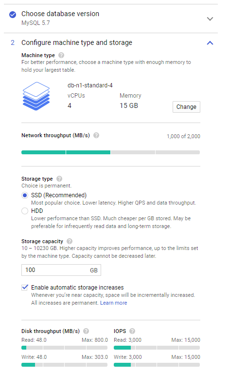
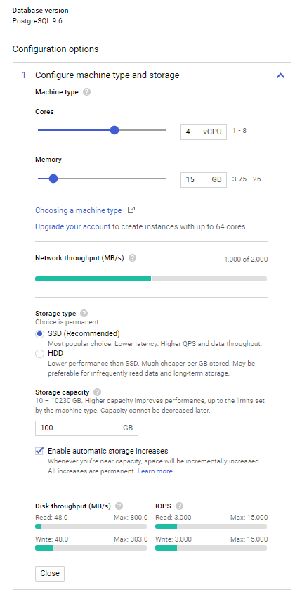
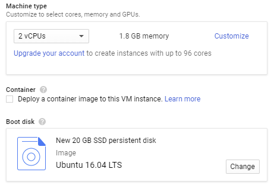

# JFleet Benchmark

## TL;DR:

[JFleet](https://github.com/jerolba/jfleet) is a Java library which persist in database large collections of Java POJOs as fast as possible, using the best available technique in each database provider, achieving it with alternate persistence methods from each JDBC driver implementation.

Its goal is to store a large amount of information in a single table using available batch persistence techniques.

JFleet Benchmark is a project which tries to measure the efficiency of JFleet comparing with different persistence techniques:
- Using JPA with Hibernate implementation 
- Using JDBC driver directly
- After a database dump, using the associated import command

### Conclusion

**JFleet performance is comparable to using the native database import tool, and is between 2.1X and 3.8X faster than using the JDBC driver directly.**

## Dataset

The selected dataset is a public dataset provided by Citi Bike NYC about each trip with their bikes.

The dataset can be downloaded from: https://s3.amazonaws.com/tripdata/index.html, and the [selected range](/downloadDataset.sh) of files are the whole 2016 year, with 457 MB of compressed CSVs files (2478 MB uncompressed). There are 13,845,655 rows in the dataset with an average size of 180 bytes per record.

Depending on the database engine, the total space used in database is around 2500 MB, using an average of 110 bytes per record.

## Hardware and Software Setup

All test has been executed under Google Cloud Platform using Cloud SQL fully-managed database service.

Both databases has the same hardware configuration:

### MySQL Setup

 

### PostgreSQL Setup

### Client Setup

The client was located in the same zone as the servers with the following configuration:

The Java runtime used was JDK 8u161.
## MySQL

### MySQL JPA Batch Insert

|Iteration|100 Rows|500 Rows|1000 Rows|5000 Rows|
|----:|----:|----:|----:|----:|
|1|747|~~660~~|691|~~766~~|
|2|~~732~~|655|691|765|
|3|737|652|~~684~~|755|
|4|744|653|688|747|
|5|740|656|694|751|
|6|746|~~648~~|685|~~742~~|
|7|733|649|685|743|
|8|740|651|688|749|
|9|~~761~~|655|~~696~~|750|
|10|739|650|689|752|
|**Avg. Sec.**|**741**|**653**|**689**|**752**|
|**Avg. row/sec**|**18,691**|**21,215**|**20,099**|**18,424**|

### MySQL JDBC Batch Insert

|Iteration|100 Rows|500 Rows|1000 Rows|5000 Rows|
|----:|----:|----:|----:|----:|
|1|1,244|661|593|565|
|2|1,274|670|609|583|
|3|1,288|684|611|572|
|4|1,275|679|612|582|
|5|1,277|680|603|~~598~~|
|6|1,276|681|608|582|
|7|1,244|674|~~624~~|584|
|8|~~1,328~~|~~713~~|611|572|
|9|1,274|671|596|562|
|10|~~1,237~~|~~658~~|~~591~~|~~560~~|
|**Avg. Sec.**|**1,269**|**675**|**605**|**575**|
|**Avg. row/sec**|**10,911**|**20,512**|**22,871**|**24,069**|

### MySQL DB Import

|Iteration|1 Import|
|----:|----:|
|1|~~221~~|
|2|174|
|3|146|
|4|141|
|5|136|
|6|137|
|7|136|
|8|~~135~~|
|9|138|
|10|135|
|**Avg. Sec.**|**143**|
|**Avg. row/sec**|**96,907**|

### MySQL JFleet Bulk Insert

|Iteration|1 MB|2 MB|4 MB|8 MB|16 MB|32 MB|64 MB|
|----:|----:|----:|----:|----:|----:|----:|----:|
|1|~~180~~|~~186~~|~~184~~|~~186~~|~~189~~|~~190~~|~~191~~|
|2|~~163~~|154|158|159|159|163|177|
|3|166|~~150~~|~~142~~|157|152|~~148~~|178|
|4|164|155|155|153|~~148~~|163|174|
|5|165|151|143|147|149|154|174|
|6|163|160|148|~~146~~|149|155|171|
|7|163|153|152|154|157|155|182|
|8|165|152|145|148|152|159|180|
|9|168|154|143|149|151|162|~~168~~|
|10|166|150|151|152|155|149|180|
|**Avg. Sec.**|**165**|**154**|**149**|**152**|**153**|**158**|**177**|
|**Avg. row/sec**|**83,913**|**90,126**|**92,691**|**90,866**|**90,494**|**87,909**|**78,224**|

### MySQL Comparison

||Best Time|Best row/sec|
|-----|----:|----:|
|JPA Batch Insert|653|21,215|
|JDBC Batch Insert|575|24,069|
|DB Import|143|96,907|
|JFleet Bulk Insert|149|92,691|

## PostgreSQL

### PostgreSQL JPA Batch Insert

|Iteration|100 Rows|500 Rows|1000 Rows|5000 Rows|
|----:|----:|----:|----:|----:|
|1|882|~~438~~|~~441~~|477|
|2|862|~~369~~|~~374~~|469|
|3|915|405|399|475|
|4|~~950~~|406|398|480|
|5|940|413|409|~~514~~|
|6|891|402|394|480|
|7|859|390|398|494|
|8|857|387|380|462|
|9|~~835~~|375|384|~~451~~|
|10|841|385|389|453|
|**Avg. Sec.**|**881**|**395**|**394**|**474**|
|**Avg. row/sec**|**15,718**|**35,019**|**35,152**|**29,226**|

### PostgreSQL JDBC Batch Insert

|Iteration|100 Rows|500 Rows|1000 Rows|5000 Rows|
|----:|----:|----:|----:|----:|
|1|1,030|365|337|~~347~~|
|2|1,033|368|335|328|
|3|1,037|371|333|324|
|4|~~1,039~~|373|336|326|
|5|1,032|364|~~330~~|~~321~~|
|6|1,018|366|333|322|
|7|1,018|~~362~~|331|323|
|8|~~1,010~~|~~385~~|~~340~~|328|
|9|1,018|364|331|347|
|10|1,023|362|331|329|
|**Avg. Sec.**|**1,026**|**367**|**333**|**328**|
|**Avg. row/sec**|**13,493**|**37,765**|**41,532**|**42,164**|

### PostgreSQL DB Import

|Iteration|1 Import|
|----:|----:|
|1|~~157~~|
|2|155|
|3|155|
|4|155|
|5|155|
|6|~~154~~|
|7|155|
|8|155|
|9|156|
|10|156|
|**Avg. Sec.**|**155**|
|**Avg. row/sec**|**89,183**|

### PostgreSQL JFleet Bulk Insert

|Iteration|1 MB|2 MB|4 MB|8 MB|16 MB|32 MB|64 MB|
|----:|----:|----:|----:|----:|----:|----:|----:|
|1|~~154~~|~~153~~|~~150~~|~~143~~|148|153|~~160~~|
|2|163|156|152|153|149|155|168|
|3|167|~~173~~|~~170~~|~~162~~|~~163~~|~~166~~|~~171~~|
|4|166|163|156|153|152|158|168|
|5|~~173~~|166|165|159|154|152|166|
|6|167|164|157|154|149|155|169|
|7|165|159|152|150|149|158|165|
|8|163|159|153|152|~~146~~|152|166|
|9|158|161|156|147|147|~~151~~|164|
|10|156|161|154|150|150|155|165|
|**Avg. Sec.**|**163**|**161**|**156**|**152**|**150**|**155**|**166**|
|**Avg. row/sec**|**84,878**|**85,931**|**88,968**|**90,940**|**92,458**|**89,471**|**83,220**|

### PostgreSQL Comparison

||Best Time|Best row/sec|
|-----|----:|----:|
|JPA Batch Insert|394|35,152|
|JDBC Batch Insert|328|42,164|
|DB Import|155|89,183|
|JFleet Bulk Insert|150|92,458|

